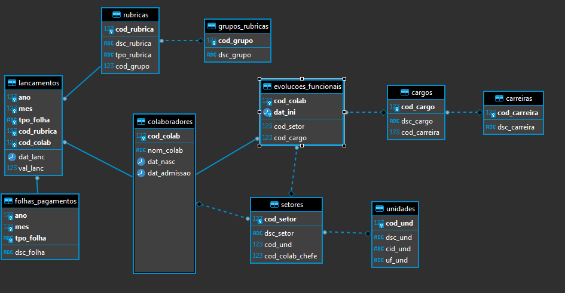
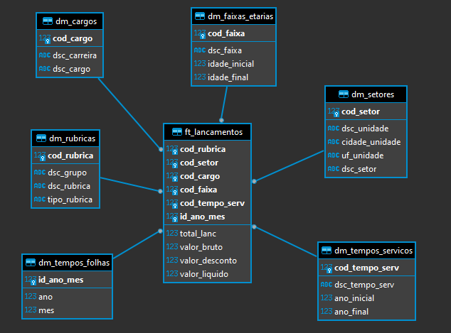

# Rotina ETL - Folha de Pagamentos

Rotina ETL para uma base de dados de folha de pagamentos. Atividade para a matéria Laboratório de Banco de Dados.

## Instruções

O objetivo da atividade é extrair os dados do banco operacional (extract), transformar as informações (transform) e carregar no banco de dados dimensional (load).

Esquema do Banco Operacional:


Esquema do Banco Dimensional:


## Como executar

### Banco de Dados
Primeiro, é necessário realizar a inicialização do banco de dados. 
Para tal, é necessário possuir em sua máquina o [Docker](https://docs.docker.com/get-docker/) e o [Docker Compose](https://docs.docker.com/compose/install/).  
No diretório do projeto, execute o comando:
```
docker-compose up -d
```
Um banco de dados do tipo `PostgreSQL` será inicializado com as seguintes configurações:
```
host: localhost
porta: 5433
usuário: postgres
senha: 123456
db: folhadb
```
O banco operacional está no schema `folha`, e o dimensional no schema `folhadw`.

### Rotina ETL
Para rodar a rotina ETL, é necessário que o [Python](https://www.python.org/downloads/) esteja instalado na máquina e precisamos instalar as bibliotecas requeridas.
Executa-se o comando:
```
pip install -r requirements.txt
```
Ou, caso prefira usar o `Poetry`
```
poetry install
```
Por fim, executa-se o arquivo do script:
```
python script/script.py
```

## Notebook
Para uma melhor visualização do passo a passo do script, há o arquivo `script/notebook.ipynb`


---
[](https://colab.research.google.com/github/nataliafonseca/etl_folha/blob/main/script/notebook.ipynb)